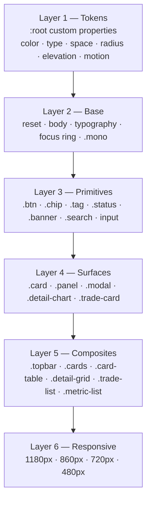
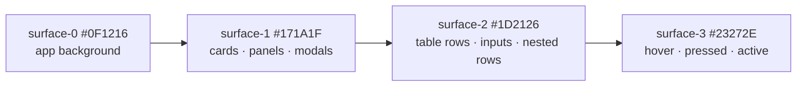
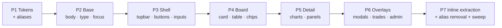

# Design Document: UI Redesign — Professional & Consistent

## Overview

Calspread is a React 18 + TypeScript + Vite dashboard for calendar-spread trading. All styling lives in a single stylesheet, `src/styles.css`, driven by CSS custom properties; components reference plain class names (no CSS modules, no Tailwind, no UI library). The current look is a "glassmorphism" dark theme: `backdrop-filter: blur(20px)` on the topbar and modal scrim, translucent white borders (`rgba(255,255,255,0.06/0.08)`), gradient wash overlays on every card, a fixed radial-gradient body background, gradient brand mark with a colored glow, and lift-on-hover transforms with large diffuse shadows.

This redesign replaces that aesthetic with a **flat, opaque, terminal-grade surface system**: solid layered backgrounds, crisp 1px opaque hairline borders, shadows reserved exclusively for true overlays (modals), and a single accent color used sparingly for interaction rather than decoration. Depth is communicated by *surface elevation steps* (progressively lighter solid fills) instead of blur and transparency — this reads as more professional, renders faster, and keeps numeric data legible against a stable background.

The redesign is also a **consistency pass**. The current stylesheet accumulated ad-hoc values: six border radii (4, 6, 8, 10, 12, 14px), eighteen distinct font sizes of which six are fractional (9.5, 10.5, 11.5, 12.5, 13.5, 14.5px), arbitrary paddings (9px, 11px, 13px, 14px), and three components that bypass the stylesheet with hardcoded inline hex colors (`StockDetail` spread analytics, `TradeConfirmModal`, `AccessTokenModal`). The new design collapses these onto a formal token scale and pulls the inline styles back into the stylesheet.

**Scope guardrail (carried from the prior redesign task):** no application logic changes. `src/api.ts` and `src/format.ts` are untouched; no `useState`/`useEffect`/`useMemo`, event handler, API call, prop, or conditional-rendering change. Permitted edits are `src/styles.css`, `index.html`, `className` / purely-presentational JSX structure (wrapper `div`s, `aria-*`) in component files, and the substitution of a static or data-driven color literal with its token value — the full Presentational_Edit set of Requirement 10.3.

---

## Architecture

### Styling layer architecture

The stylesheet is restructured into ordered layers. Every visual value flows down from the token layer — no component rule may introduce a raw color.



**Rule of dependency:** a layer may only consume tokens and layers above it. Layer 5 rules must not redefine colors or spacing already expressed by Layers 3–4; they position and compose.

### Surface elevation model (replaces blur/transparency)



Each step is a **solid** fill separated by a `1px solid var(--border)` hairline. Nothing is translucent, nothing is blurred. A component's perceived depth equals its surface index — so a nested trade row inside a modal (surface-1) uses surface-2, and its hover state uses surface-3.

### De-glassing map

| Current glass technique | Location | Replacement |
|---|---|---|
| `backdrop-filter: blur(20px) saturate(150%)` | `.topbar` | Opaque `var(--surface-0)` + `1px solid var(--border)` bottom hairline |
| `backdrop-filter: blur(6px)` | `.modal-overlay` | Solid scrim `rgba(6,8,10,0.72)`, no filter |
| Body `radial-gradient` ×2, `background-attachment: fixed` | `body` | Flat `var(--surface-0)` |
| `linear-gradient(180deg, var(--glass), transparent)` overlay | `.card`, `.detail-chart` | Flat `var(--surface-1)` |
| `.card::before` blue gradient hairline on hover | `.card` | Removed; hover = border color change only |
| `linear-gradient(135deg, accent, cyan)` + `box-shadow` glow | `.brand-mark` | Flat `var(--accent)` fill, no glow |
| `.admin-card::before` gradient top rule | `.admin-card` | Removed (or flat 2px `var(--accent)` if a marker is wanted) |
| `translateY(-1px/-2px)` + `0 8px 32px` shadow on hover | `.card`, `.btn` | No transform; `background`/`border-color` transition only |
| `rgba(255,255,255,0.0x)` borders & row stripes | throughout | Opaque `var(--border)`, `var(--border-subtle)`, `var(--surface-2)` |
| `--shadow: 0 20px 60px …` on cards | `.card`, `.admin-card` | Cards get no shadow; overlays get `--shadow-overlay` |

---

## Design Token System

### Color

Three-value naming: `--surface-*` (backgrounds), `--text-*` (foregrounds), semantic roles. All hex, all opaque, except four intentional alpha-bearing tokens: `--scrim`, `--ring`, and the two shadow tokens `--shadow-popover` / `--shadow-overlay`.

```css
:root {
  /* ---- Surfaces (elevation steps) ---- */
  --surface-0: #0f1216;   /* app background, topbar */
  --surface-1: #171a1f;   /* cards, panels, modal body */
  --surface-2: #1d2126;   /* table rows, inputs, nested rows */
  --surface-3: #23272e;   /* hover / pressed / active */

  /* ---- Borders ---- */
  --border-subtle: #1f242b;  /* inner dividers, table row rules */
  --border: #2a3038;         /* default component outline */
  --border-strong: #383f4a;  /* emphasis, hover outline */

  /* ---- Text ---- */
  --text-1: #e6e9ee;  /* primary values, headings */
  --text-2: #9ba3af;  /* secondary labels, meta */
  --text-3: #7d8590;  /* tertiary: uppercase micro-labels, axes */

  /* ---- Accent (interaction only) ---- */
  --accent: #2f6fed;         /* button fill, active segment */
  --accent-hover: #1f5ad6;
  --accent-text: #7fb0ff;    /* links, accent text on dark */
  --accent-surface: #16233d; /* selected/active row tint (opaque) */
  --accent-border: #2b4a8a;

  /* ---- Semantic: P&L ---- */
  --pos: #3fb950;
  --pos-surface: #12251a;
  --neg: #f85149;
  --neg-surface: #2a1618;
  --warn: #d29922;
  --warn-surface: #2a2113;

  /* ---- Semantic: premium / discount (distinct from P&L) ---- */
  --prem: #58a6ff;
  --prem-surface: #14243c;
  --disc: #e3b341;
  --disc-surface: #2b2313;

  /* ---- Data viz ---- */
  --oi: #39a0b5;
  --series-1: #58a6ff;
  --series-2: #3fb950;
  --series-3: #d29922;
  --series-expired: #6e7681;
  --chart-grid: #23272e;
  --chart-guide: #333a44;

  /* ---- Typography ---- */
  --font-ui: "Inter", system-ui, -apple-system, "Segoe UI", Roboto, sans-serif;
  --font-mono: "JetBrains Mono", ui-monospace, SFMono-Regular, Menlo, monospace;
  --fs-1: 10px;  /* uppercase micro-labels, chart axes */
  --fs-2: 11px;  /* meta, pills, legends */
  --fs-3: 12px;  /* dense tabular data */
  --fs-4: 13px;  /* body / base */
  --fs-5: 15px;  /* prices, emphasised numbers */
  --fs-6: 18px;  /* section & modal headings */
  --fs-7: 22px;  /* page title */
  --fw-regular: 400;
  --fw-medium: 500;
  --fw-semibold: 600;
  --fw-bold: 700;
  --lh-tight: 1.25;
  --lh-base: 1.5;
  --tracking-caps: 0.06em;  /* uppercase labels only */

  /* ---- Spacing: 8 steps on a 4px base. The suffix is the 4px multiple, so the
         scale skips --sp-7 and --sp-9 by design — there are 8 tokens, not 10. ---- */
  --sp-1: 4px;  --sp-2: 8px;  --sp-3: 12px; --sp-4: 16px;
  --sp-5: 20px; --sp-6: 24px; --sp-8: 32px; --sp-10: 40px;

  /* ---- Radius ---- */
  --r-sm: 4px;    /* chips, tags, badges */
  --r-md: 6px;    /* buttons, inputs */
  --r-lg: 8px;    /* cards, panels, modals */
  --r-pill: 999px;

  /* ---- Elevation (overlays only) ---- */
  --shadow-popover: 0 4px 12px rgba(0, 0, 0, 0.35);
  --shadow-overlay: 0 12px 32px rgba(0, 0, 0, 0.5);
  --scrim: rgba(6, 8, 10, 0.72);
  --ring: 0 0 0 3px rgba(47, 111, 237, 0.35);

  /* ---- Motion ---- */
  --dur-fast: 110ms;
  --dur: 160ms;
  --ease: cubic-bezier(0.2, 0, 0.2, 1);
}
```

**Token rules**

1. Fractional font sizes are eliminated — every size is one of `--fs-1`…`--fs-7`.
2. Radii collapse from six values to three plus pill. `10px`/`12px`/`14px` are gone; `--r-lg: 8px` is the largest.
3. `--tracking-caps` is applied **only** to uppercase micro-labels; body text gets no letter-spacing, headings get none (the current `-0.5px` negative tracking on `h1` is dropped).
4. Elevation tokens appear in exactly three places: `.modal`, `.chart-tip`, `.admin-card`. Cards and panels use borders only.
5. Contrast: `--text-1` (≈13:1), `--text-2` (≈6.9:1), `--text-3` (≈4.7:1) all clear WCAG AA on `--surface-1`. `--accent` is a *fill* token only (white-on-accent ≈4.6:1); accent **text** must use `--accent-text`.

### Backwards-compatibility alias block

To keep the migration incremental and the build green at every step, Phase 1 adds the new tokens **alongside** aliases for the old names. Existing rules keep working while they are rewritten layer by layer; the alias block is deleted in the final phase.

```css
/* TEMPORARY — removed in Phase 7 */
:root {
  --bg: var(--surface-0);
  --bg-elev: var(--surface-2);
  --panel: var(--surface-1);
  --panel-2: var(--surface-3);
  --text: var(--text-1);
  --muted: var(--text-2);
  --faint: var(--text-3);
  --radius: var(--r-lg);
  --radius-sm: var(--r-md);
  --glass: transparent;
  --glass-border: var(--border);
}
```

---

## Components and Interfaces

Class names are the contract between `styles.css` and the TSX files. **Every existing class name is preserved**; new classes are additive.

### Interaction state contract

Applied uniformly to every interactive surface (`.btn`, `.card--clickable`, `.trade-card--clickable`, `.chart-toggle button`, `.modal-x`, table rows):

```ts
interface InteractionStates {
  rest:     { background: 'surface-1 | surface-2'; border: 'border' };
  hover:    { background: 'next surface step';     border: 'border-strong' };  // no transform
  active:   { background: 'surface-3';             border: 'border-strong' };
  focus:    { boxShadow: 'ring';                   border: 'accent' };         // :focus-visible
  selected: { background: 'accent | accent-surface'; border: 'accent-border' };
  disabled: { opacity: 0.45; cursor: 'default' };  // no hover response at all
}
```

### 1. Global shell — `.app`, `body`

- `body`: flat `--surface-0`, no gradients, no `background-attachment`, base `--fs-4` / `--lh-base`.
- `.app`: `max-width: 1480px`, horizontal padding `--sp-6` desktop → `--sp-4` (860px) → `--sp-3` (720px) → `--sp-2` (480px), matching the breakpoint table below.
- `index.html`: `theme-color` updated `#0b0e14` → `#0f1216`. Font links unchanged (Inter + JetBrains Mono already loaded and both are retained).

### 2. Topbar — `.topbar`, `.brand`, `.brand-mark`, `.subtitle`, `.toolbar`

- Sticky, `background: var(--surface-0)` (opaque — this is the single most important de-glassing change since the blurred bar smears scrolling numbers), `border-bottom: 1px solid var(--border)`, padding `--sp-3 --sp-4`.
- `.brand-mark`: 32px, `--r-md`, flat `var(--accent)`, white glyph, **no** gradient and **no** glow. Grows to 40px on the admin card only.
- `.brand h1`: `--fs-7`, `--fw-semibold`, no negative tracking.
- `.toolbar`: `gap: var(--sp-2)`.

**Toolbar density (optional, recommended).** The toolbar can render up to nine controls (Arbitrage, Min Arb, Max Arb, OI, Spread, Depth, Trades, Access Token, Logout) as identical `.btn`s, which is the biggest remaining consistency problem. Fix with presentation-only grouping — wrap the filter/sort buttons in `<div className="btn-group">` and give toggle buttons `aria-pressed`:

```css
.btn-group { display: inline-flex; border: 1px solid var(--border); border-radius: var(--r-md); overflow: hidden; }
.btn-group .btn { border: none; border-radius: 0; background: var(--surface-1); }
.btn-group .btn + .btn { border-left: 1px solid var(--border); }
.btn-group .btn--primary { background: var(--accent-surface); color: var(--accent-text); }
```

The group — not the member button — owns the outline and the radius, so each button keeps the shared 32px height and `--fs-4` type of criterion 4.5; only the border and corner treatment move up to the wrapper. This changes JSX structure only (a wrapper element and an ARIA attribute), not logic, props, or handlers.

### 3. Buttons — `.btn`, `.btn--primary`, `.btn--sm`, `.btn--full`, `.btn--trade`, `.btn--danger`, `.btn--danger-ghost`, `.btn-badge`

Four variants, one geometry. Height 32px (`--sp-2` vertical padding, `--fs-4`, `--fw-medium`, `--r-md`); `.btn--sm` 26px / `--fs-3`; touch target ≥44px below 480px via `min-height`.

| Variant | Rest | Hover |
|---|---|---|
| `.btn` (default) | `--surface-2` + `--border` | `--surface-3` + `--border-strong` |
| `.btn--primary` | `--accent`, white text | `--accent-hover` |
| `.btn--trade` | `--accent-surface`, `--accent-text`, `--accent-border` | `--surface-3` + `--accent` border |
| `.btn--danger` | `--neg`, white text | darkened `--neg` |
| `.btn--danger-ghost` | transparent, `--neg` text, `--neg` border | `--neg-surface` |

All `translateY` hover lifts and colored glow shadows are removed. `:disabled` suppresses every hover rule. This also retires a one-off patch: the current stylesheet needs `.btn--danger:disabled { transform: none; }` purely to undo the lift it introduces elsewhere, and with no transforms in the sheet that override becomes unnecessary.

### 4. Stock card — `.card`, `.card-head`, `.card-title`, `.card-symbol`, `.card-name`, `.card-quote`, `.card-price`, `.card-spread`, `.card-foot`, `.badge-index`, `.card--clickable`

```
┌─────────────────────────────────────────────┐  surface-1, 1px border, r-lg
│ RELIANCE  [INDEX]              2,845.60     │  card-head: sp-3 sp-4, border-bottom
│ Reliance Industries      +1.24%  Spread +12 │
├─────────────────────────────────────────────┤
│ CONTRACT      LTP      FAIR    PREM/DISC    │  fs-1 uppercase, text-3, tracking-caps
│ 25 Jul  28d   2851.2  2849.9      +5.60     │  fs-3 mono tabular, zebra = surface-2
│ 29 Aug  63d   2860.0  2857.1     +14.40     │
├─────────────────────────────────────────────┤
│ [           Take Trade           ]          │  card-foot, border-top
└─────────────────────────────────────────────┘
```

- Flat `--surface-1`; no gradient overlay, no `::before` accent line, no shadow, no hover lift. Hover: `border-color: var(--border-strong)` + `background: var(--surface-2)` only.
- `.card-symbol` `--fs-4`/`--fw-semibold` (was 14.5px/700); `.card-price` `--fs-5` mono; `.card-name` `--fs-2`/`--text-2`.
- `.badge-index`: `--fs-1`, `--r-sm`, `--prem-surface` bg, `--prem` text — an informational tag, not an accent-colored one.

### 5. Card table — `.card-table`, `.num`, `.fair`, `.contract-name`, `.contract-meta`, `.contract-oi`, `.row-spot`

- `thead th`: `--fs-1`, `--fw-semibold`, uppercase, `--tracking-caps`, `--text-3`, `border-bottom: 1px solid var(--border)`.
- `td`: `--fs-3`, padding `--sp-2 --sp-4`, `border-bottom: 1px solid var(--border-subtle)`.
- Zebra: `tbody tr:nth-child(even) { background: var(--surface-2); }` — opaque, replacing `rgba(255,255,255,0.015)`.
- Row hover: `background: var(--surface-3)`. `.row-spot`: `background: var(--accent-surface)` with `box-shadow: inset 3px 0 0 var(--accent)` as a left marker rail — the same 3px rail width used by `.banner`, so the two marker treatments read as one idiom. These inset rails, and the `--ring` focus indicator, are *marker* shadows, not elevation shadows, and so sit outside the three-value elevation budget.
- Every numeric cell inherits `.mono` behaviour: `font-variant-numeric: tabular-nums` so columns never jitter as ticks arrive. This is promoted to a rule on `.num`, `.card-price`, `.chip`, `.leg-cell`, `.trade-pnl`, and `.metric-value`.

### 6. Value chips — `.chip`, `.pos`, `.neg`, `.muted`, `.tag`, `.tag--prem`, `.tag--disc`

The current stylesheet is inconsistent: `.chip.prem`/`.chip.disc` strip their padding and background while `.chip` reserves `min-width: 56px`. New rule — **one chip geometry, tinted surfaces**:

```css
.chip {
  display: inline-block; min-width: 60px; text-align: right;
  padding: var(--sp-1) var(--sp-2); border-radius: var(--r-sm);
  font: var(--fw-semibold) var(--fs-3)/1 var(--font-mono);
  font-variant-numeric: tabular-nums;
}
.chip.prem  { color: var(--prem); background: var(--prem-surface); }
.chip.disc  { color: var(--disc); background: var(--disc-surface); }
.chip.pos   { color: var(--pos);  background: var(--pos-surface); }
.chip.neg   { color: var(--neg);  background: var(--neg-surface); }
.chip.muted { color: var(--text-3); background: var(--surface-2); }
```

The four-state color system is preserved: **prem/disc (blue/amber)** for premium-vs-discount, **pos/neg (green/red)** for P&L. They must never be conflated — that distinction is load-bearing for the trader and is protected by a correctness property below.

### 7. Status & counters — `.status`, `.status-dot`, `.status--live`, `.status--wait`, `.count`, `.pill-count`, `.btn-badge`

- `.status`: pill, `--fs-2`, `--fw-medium`, tinted surface per state (`--pos-surface` / `--warn-surface` / `--surface-2`).
- The `pulse` keyframe animation is kept — it is a live-data affordance, not decoration — but the glow radius shrinks to 4px and it is disabled under `@media (prefers-reduced-motion: reduce)`.

### 8. Inputs — `.search`, `.search-wrap`, `.rf`, `.admin-input`

Unified input geometry: `--surface-2` fill, `1px solid var(--border)`, `--r-md`, 32px height, `--fs-4`. Focus: `border-color: var(--accent)` + `box-shadow: var(--ring)` (replacing the current one-off `rgba(59,130,246,0.15)` glows). `.admin-input` drops its 2px letter-spacing gimmick and centered text in favour of the standard input, left-aligned.

### 9. Banners & links — `.banner`, `.banner--error`, `.banner--info`, `.link`, `.empty`, `.spinner`

- `.banner`: `--surface-2`, `1px solid var(--border)`, `--r-md`, `--sp-3 --sp-4`, plus a 3px left severity rail (`box-shadow: inset 3px 0 0 var(--neg)` for `.banner--error`, `var(--accent)` for `.banner--info`) — a flat, professional severity cue that replaces the tinted-glass look. Error/info text uses `--neg` / `--accent-text` rather than the current ad-hoc `#ffa0a8` / `#93c5fd`.

### 10. Modals — `.modal-overlay`, `.modal`, `.modal-head`, `.modal-sub`, `.modal-body`, `.modal-x`

- `.modal-overlay`: solid `var(--scrim)`, **no** `backdrop-filter`.
- `.modal`: `--surface-1`, `1px solid var(--border)`, `--r-lg`, `--shadow-overlay` (the one place a large shadow is legitimate).
- `.modal-head` / footer: `--sp-4` padding, `border-bottom: 1px solid var(--border)`; `h2` at `--fs-6`.
- `.modal-x`: 28px square, `--r-md`, `--surface-2`, standard hover.
- Modal widths become tokens rather than inline `style={{ maxWidth }}`: `.modal--sm` (440px, TradeConfirm), `.modal--md` (520px, AccessToken), default 660px (Trades).

### 11. Trades panel — `.trade-section`, `.trade-section-title`, `.trade-card`, `.trade-head`, `.trade-symbol`, `.trade-spot`, `.leg-grid`, `.leg-line`, `.leg-tag`, `.leg-exp`, `.leg-cell`, `.leg-pnl`, `.trade-foot`, `.trade-net`, `.trade-pnl`, `.trade-roi`, `.trade-meta`, `.trade-closed-tag`, `.trade-del-confirm`

- `.trade-card` sits on modal `--surface-1`, so it takes `--surface-2` + `--border` + `--r-md`; hover → `--surface-3`.
- `.leg-line` grid keeps its 5-column layout; all cells mono + tabular so BUY/SELL rows align digit-for-digit.
- `.leg-tag`: `--fs-1`, `--r-sm`, `--prem-surface`/`--disc-surface` (BUY = prem blue, SELL = disc amber, matching the board).
- `.trade-card--closed` uses `opacity: 1` with `--text-2` values and a `.trade-closed-tag` badge instead of the current blanket fade (`opacity: 0.88` on `.trade-card--closed`, `0.85` on the legacy `.trade-row--closed` and on `.trade-roi`) — fading real numbers hurts legibility.

### 12. Detail page & charts — `.detail-grid`, `.detail-card`, `.detail-charts`, `.detail-chart`, `.oi-panel`, `.chart-head`, `.chart-sub`, `.chart-toggle`, `.chart-grid`, `.chart-guide`, `.chart-ylabel`, `.chart-xlabel`, `.chart-legend`, `.chart-dot`, `.chart-tip`, `.chart-empty`

- `.detail-chart`: flat `--surface-1`, border, `--r-lg`, no gradient wash.
- `.chart-toggle`: proper segmented control — `--border` outline, `--r-md`, active segment `--accent` with white text, inactive `--text-2` on `--surface-2`; 28px tall above 480px, ≥44px at ≤480px (the touch-target minimum wins over the compact height).
- SVG stroke/fill tokens: `.chart-grid` → `var(--chart-grid)`, `.chart-guide` → `var(--chart-guide)`, axis labels → `var(--text-3)` at `--fs-1` mono.
- `.chart-tip`: `--surface-1` + `--border-strong` + `--shadow-popover` (no translucency, so it stays readable over dense lines).
- **Series colors move into tokens.** `LineChart` receives colors as props from `StockDetail`'s `LINE_COLORS` / `EXPIRED_COLOR` constants. Today those constants hold their own off-palette literals, which is why chart lines and chips disagree. The migration replaces the values with the `--series-*` token values, mapped in near/next/far contract order — same shape, same arity, no logic change:

```ts
// StockDetail.tsx — before (current code)
const LINE_COLORS = ["#4d8bff", "#22c55e", "#f59e0b"];
const EXPIRED_COLOR = "#8d97ac";

// StockDetail.tsx — after (token values)
const LINE_COLORS = ["#58a6ff", "#3fb950", "#d29922"]; // --series-1, --series-2, --series-3
const EXPIRED_COLOR = "#6e7681";                        // --series-expired
```

- **Radius decision:** the one-off `border-radius: 2px` on `.oi-dot` and `.chart-dot` — a seventh radius outside the four-radius budget of criterion 4.2 — is folded onto `--r-sm`, while the `50%` on `.status-dot`/`.spinner` stays as-is since a circle is not a rectangular radius.

### 13. Inline-style extraction (new classes)

Three components hardcode colors and layout inline, which is the main source of drift. Each becomes a stylesheet class with identical rendered structure.

| Component | Current inline style | New class |
|---|---|---|
| `StockDetail` spread analytics | `marginTop`, `borderTop: rgba(255,255,255,0.08)`, `background: rgba(255,255,255,0.03)`, `borderRadius: 6` per row | `.metric-panel`, `.metric-panel-title`, `.metric-list`, `.metric-row`, `.metric-label`, `.metric-value` |
| `TradeConfirmModal` | `rgba(255,255,255,0.04)` hero block, per-row `rgba(255,255,255,0.03)`, `#22c55e`/`#ef4444`/`#9ca3af` | `.confirm-hero`, `.confirm-hero-label`, `.confirm-hero-value`, reuses `.metric-*` |
| `AccessTokenModal` | `rgba(255,255,255,0.05)` code block, `#9ca3af` labels | `.token-field`, `.token-label`, `.token-value`, `.token-note` |

The green/red/muted literals (`#22c55e`, `#ef4444`, and two different greys — `#94a3b8` in `StockDetail`, `#9ca3af` in `TradeConfirmModal` and `AccessTokenModal`, itself an instance of the drift) are consumed by `style={{ color }}` on JSX-computed values. Since those are *data-driven* values, the metric arrays keep their shape but the literals are swapped for the token hexes (`--pos` `#3fb950`, `--neg` `#f85149`, `--text-2` `#9ba3af`) — a value substitution, not a control-flow change. Where a value is purely static (labels, backgrounds), the inline style is deleted in favour of the class.

```css
.metric-row {
  display: flex; align-items: center; justify-content: space-between;
  gap: var(--sp-3); padding: var(--sp-2) var(--sp-3);
  background: var(--surface-2); border: 1px solid var(--border-subtle);
  border-radius: var(--r-sm);
}
.metric-label { font-size: var(--fs-3); color: var(--text-2); }
.metric-value {
  font: var(--fw-semibold) var(--fs-4)/1 var(--font-mono);
  font-variant-numeric: tabular-nums;
}
```

### 14. Skeletons — `.skeleton`, `.sk`, `.sk-symbol`, `.sk-name`, `.sk-price`, `.sk-row`

Shimmer gradient rebuilt on opaque stops (`--surface-2` → `--surface-3` → `--surface-2`) instead of white alpha, so loading cards sit at the same elevation as loaded cards and the grid does not visibly shift. Honors `prefers-reduced-motion` by falling back to a static `--surface-2` fill.

### 15. Admin page — `.admin-page`, `.admin-card`, `.admin-subtitle`, `.admin-error`, `.btn--full`

Flat `--surface-1` card, `--border`, `--r-lg`, `--shadow-overlay`, `--sp-8` padding, max-width 400px. Gradient top rule removed. The `Admin.tsx` brand-mark SVG currently hardcodes `stroke="#6366f1"`/`fill="#6366f1"` (indigo) while the topbar mark uses white-on-blue — these are unified to `#ffffff` on the flat accent mark, fixing a visible cross-screen inconsistency.

---

## Data Models

### Token contract

```ts
type Surface = 'surface-0' | 'surface-1' | 'surface-2' | 'surface-3';
type TextRole = 'text-1' | 'text-2' | 'text-3';
type Semantic = 'pos' | 'neg' | 'warn' | 'prem' | 'disc' | 'accent';
type Radius = 'r-sm' | 'r-md' | 'r-lg' | 'r-pill';
type FontSize = 'fs-1' | 'fs-2' | 'fs-3' | 'fs-4' | 'fs-5' | 'fs-6' | 'fs-7';
type Space = 'sp-1' | 'sp-2' | 'sp-3' | 'sp-4' | 'sp-5' | 'sp-6' | 'sp-8' | 'sp-10';

interface ComponentStyle {
  surface: Surface;              // solid fill — never a gradient
  border: 'border-subtle' | 'border' | 'border-strong';
  radius: Radius;
  padding: [Space, Space];
  elevation: 'none' | 'popover' | 'overlay';  // 'none' for all cards/panels
}
```

**Validation rules**

1. `elevation !== 'none'` is permitted only for `.modal`, `.chart-tip`, `.admin-card`.
2. `surface` must be a token reference; gradient and `rgba(255,255,255,*)` fills are disallowed outside `--scrim`, `--ring`, and the two shadow tokens.
3. `backdrop-filter` must not appear anywhere in `styles.css`.
4. A nested component's surface index must be strictly greater than its parent's. At the top of the ladder this is unsatisfiable, so the ceiling case is explicit: a component nested inside a `--surface-3` container also takes `--surface-3` and separates itself with a `1px solid var(--border-strong)` border instead of a fill step.
5. Any numeric text node must resolve to `--font-mono` with `tabular-nums`.

### Responsive breakpoint model

| Breakpoint | Cards grid | Detail grid | Shell padding | Notes |
|---|---|---|---|---|
| ≥1181px | 3 columns | `minmax(300px,380px) 1fr` | `--sp-6` | full toolbar in one row |
| 861–1180px | 2 columns | 2 columns | `--sp-6` | toolbar wraps |
| 721–860px | 2 columns | 1 column | `--sp-4` | charts full width |
| 481–720px | 1 column | 1 column | `--sp-3` | search full width, `order: 3` |
| ≤480px | 1 column | 1 column | `--sp-2` | tap targets ≥44px; fixed table layout; `--fs-3` → `--fs-2` in tables |

The existing 1180/720/480 breakpoints are kept and 860px (already used by `.detail-grid`) is formalised as the fourth, so the detail page and the board no longer reflow at unrelated widths.

---

## Correctness Properties

*A property is a characteristic or behavior that should hold true across all valid executions of a system — essentially, a formal statement about what the system should do. Properties serve as the bridge between human-readable specifications and machine-verifiable correctness guarantees.*

**Verification note.** The artifact under test is a static stylesheet plus presentational JSX, and the project has no test framework. These properties are therefore universally-quantified *static* invariants: each is verified by a grep/static assertion over the finished files, by the build, or by the manual visual checklist — not by a generator-driven property test runner. Property-based testing is not applicable to declarative style rules.

### Property 1: No glass remains

*For all* declarations in `styles.css`, none is `backdrop-filter`, `-webkit-backdrop-filter`, or `filter: blur(`, and none uses `radial-gradient` or `conic-gradient`; the only `linear-gradient` consumer is the `.sk` skeleton shimmer rule, whose stops are opaque surface tokens rather than white-alpha values.

**Validates: Requirements 1.1, 1.2, 1.3**

### Property 2: Token closure — no raw color, no dangling reference

*For all* color literals in `styles.css` (`#` hex, `rgb(`, `rgba(`, `hsl(`, `hsla(`), the literal appears inside the `:root` token declaration and nowhere else, with only the keywords `transparent`, `inherit`, and `currentColor` permitted in component rules; alpha-bearing tokens are limited to `--scrim`, `--ring`, `--shadow-popover`, `--shadow-overlay`. *For all* `var()` references in the stylesheet, the referenced name resolves to a token declared in the token block or the alias block — a reference that resolves to nothing is repaired (token added or reference corrected) before the phase closes.

**Validates: Requirements 3.2, 3.3, 3.4, 3.7**

### Property 3: Class-name preservation

*For all* class names referenced by a `className` expression in `src/*.tsx`, a matching selector exists in `styles.css`; the pre-migration selector set is a subset of the post-migration selector set.

**Validates: Requirements 7.1, 7.2, 7.3, 7.4**

### Property 4: Bounded design vocabulary

*For all* value sets in `styles.css`, distinct `font-size` values ≤ 7 with no fractional sizes, distinct `border-radius` values ≤ 4, and distinct *non-inset elevation* `box-shadow` values ≤ 3 (the `.row-spot` and `.banner` inset rails and the `--ring` focus indicator are marker shadows and are excluded from that count). *For all* values the migration needs, the value is either an existing token reference or a token newly added to the token block — no rule reintroduces an ad-hoc literal, so the vocabulary cannot silently re-expand.

**Validates: Requirements 4.1, 4.2, 4.4, 4.12**

### Property 5: P&L / prem-disc separation

*For all* selectors that assign a state color, a premium/discount class resolves only to the `--prem`/`--disc` token families and a P&L class resolves only to the `--pos`/`--neg` families; the four hues are pairwise distinct. *For all* rendered premium/discount and profit/loss values, the distinction is additionally carried by a sign character or a text label, so it survives grayscale rendering and color-vision deficiency rather than depending on hue alone.

**Validates: Requirements 5.1, 5.2, 5.3, 5.8**

### Property 6: Elevation monotonicity

*For all* parent/child component pairs, the child's surface index is strictly greater than the parent's, except at the ceiling: *for all* pairs whose parent is already `--surface-3`, the child also takes `--surface-3` and separates itself with a `1px solid var(--border-strong)` border. Adjacent surfaces are separated by a `1px solid` border token, and `box-shadow` elevation appears only on `.modal`, `.chart-tip`, `.admin-card`.

**Validates: Requirements 2.4, 2.5, 2.6, 2.9**

### Property 7: Focus visibility

*For all* focusable elements (`button`, `a`, `input`, `[tabindex]`), a `:focus-visible` rule produces `var(--ring)` with a `var(--accent)` border, and every `outline: none` declaration is paired with a replacement indicator.

**Validates: Requirements 8.4, 8.5**

### Property 8: Contrast

*For all* text/background token pairs used in the stylesheet, the contrast ratio is ≥4.5:1 below `--fs-5` and ≥3:1 at `--fs-5` or larger in bold; `--accent` is never used as a text color, and each semantic foreground clears 4.5:1 on its own tinted surface.

**Validates: Requirements 8.1, 8.2, 8.3**

### Property 9: Touch targets

*For all* `button`, `a.btn`, `input`, and `.chart-toggle` segments at viewport widths ≤480px, the computed `min-height` is ≥44px.

**Validates: Requirements 8.6**

### Property 10: Logic untouched

*For all* files in the diff, `src/api.ts` and `src/format.ts` are absent, `src/main.tsx` and `src/LineChart.tsx` show no logic change, `package.json` dependencies are unchanged, and no changed `.tsx` line contains `useState`, `useEffect`, `useMemo`, `useRef`, `fetch`, `await`, or an `on[A-Z]` handler assignment.

**Validates: Requirements 10.1, 10.2, 10.3, 10.4, 10.5, 10.6**

### Property 11: Build integrity

*For all* migration phases, `npx tsc -b` exits 0, `npx vite build` produces a bundle, the static assertion families all pass, and the manual checklist is executed at 1440/1024/768/390px with any failure resolved before the phase closes.

**Validates: Requirements 12.1, 12.2, 12.3, 12.4, 12.5, 12.6**

### Property 12: Motion respect

*For all* `animation` and `transition` declarations, the `prefers-reduced-motion: reduce` block neutralises the declaration, while the retained `pulse` affordance keeps a glow radius ≤4px in the default mode.

**Validates: Requirements 8.7, 8.8**

### Property 13: Opaque token-driven fills

*For all* visible components, the background resolves to a single opaque Surface_Token (or semantic surface token) reference — `body` and `.topbar` to `--surface-0`, `.card`/`.detail-chart` to `--surface-1`, rows and inputs to `--surface-2` — with no gradient overlay, no `::before` accent rule, no `background-attachment`, no translucent border, and marker emphasis expressed as an inset rail rather than a glow.

**Validates: Requirements 1.4, 1.5, 1.6, 1.7, 1.8, 1.10, 2.1, 2.2, 2.3, 2.7, 2.8, 3.1**

### Property 14: Hover and disabled state invariance

*For all* interactive elements, a hover rule declares only `background`, `background-color`, `border-color`, or `color` — never `transform`, `box-shadow`, `filter`, or `opacity` — so the rendered position is unchanged; and *for all* elements carrying `disabled` or `aria-disabled="true"`, the computed `background`, `border-color`, and `transform` are identical hovered and un-hovered, at 0.45 opacity with a default cursor.

**Validates: Requirements 1.9, 4.10**

### Property 15: Uniform control geometry and spacing scale

*For all* controls within a family, one geometry applies: the three input selectors share the identical tuple (`--surface-2` fill, `var(--border)`, `--r-md`, 32px, `--fs-4`, left-aligned), every `.chip` state modifier retains the base chip geometry (`min-width: 60px`, `--sp-1`/`--sp-2` padding, `--r-sm`, `--fs-3` semibold mono), `.btn` variants differ only in color over a shared 32px geometry, exactly one `.chart-toggle` segment carries the active fill at a 28px segment height, and every padding/margin/gap value is a 4px-scale token with `--tracking-caps` confined to uppercase micro-labels. The fixed 32px/26px/28px heights are the above-480px geometry; at ≤480px the touch-target minimum of Property 9 governs instead, so the two rules never conflict.

**Validates: Requirements 4.3, 4.5, 4.6, 4.7, 4.8, 4.9, 4.11**

### Property 16: Numeric legibility

*For all* Numeric_Cells — including cells inside closed trade cards — the text renders in `var(--font-mono)` with `font-variant-numeric: tabular-nums` at full opacity, so columns hold their alignment as ticks arrive and closed positions stay readable.

**Validates: Requirements 5.4, 8.9**

### Property 17: Palette agreement across CSS and TSX

*For all* colors consumed by the charting and messaging layers through the Stylesheet, the `StockDetail` series constants, or the banner rules, the value equals its token: after migration the `LINE_COLORS`/`EXPIRED_COLOR` constants hold the `--series-1`/`--series-2`/`--series-3` values in near/next/far contract order and the `--series-expired` value — none of the pre-migration literals (`#4d8bff`, `#22c55e`, `#f59e0b`, `#8d97ac`) survives — SVG grid/guide/axis furniture references the chart tokens, and banner text references `--neg` or `--accent-text`.

**Validates: Requirements 5.5, 5.6, 5.7**

### Property 18: Cross-screen shell consistency

*For all* screens, the shell chrome agrees: the `theme-color` meta value equals `--surface-0`, the font stack names only the two already-loaded families, and the Admin brand mark renders with the same white-on-accent treatment as the topbar mark.

**Validates: Requirements 3.5, 3.6, 6.7**

### Property 19: Inline-style extraction completeness

*For all* static inline style declarations in `StockDetail`, `TradeConfirmModal`, and `AccessTokenModal`, the declaration is replaced by a stylesheet class (`.metric-*`, `.confirm-*`, `.token-*`, `.modal--sm`/`.modal--md`); *for all* remaining data-driven inline declarations, the shape is unchanged and only the color literal is substituted with its token value, and the token field retains `user-select: all` with unchanged copy behavior. The closing assertion — the one that actually proves the extraction finished — is that *for all* three files, zero `rgba(` literals remain and the only surviving hex literals are the token values permitted for data-driven color.

**Validates: Requirements 6.1, 6.2, 6.3, 6.4, 6.5, 6.6, 6.8, 6.9**

### Property 20: Breakpoint closure and skeleton parity

*For all* media queries in `styles.css`, the breakpoint is a member of {1180, 860, 720, 480}; *for all* four bands plus the desktop band, the declared grid columns, detail-grid shape, and shell padding apply as tabulated; and the skeleton and loaded table cells share one padding token pair so no layout shifts when data lands.

**Validates: Requirements 9.1, 9.2, 9.3, 9.4, 9.5, 9.6, 9.7**

### Property 21: Migration reversibility and alias safety

*For all* migration phases executed in the stated order, the phase ends with every screen viewable; *for all* Legacy_Token_Names still referenced, an alias definition exists while the Alias_Block is present; and the Alias_Block is deleted only when the legacy-name search returns zero hits, with `.tsx` edits confined to the final three phases.

**Validates: Requirements 11.1, 11.2, 11.3, 11.4, 11.5, 11.6, 11.7**

---

## Error Handling

### Class-name drift

**Condition:** a rule is renamed while a `.tsx` file still references the old name → element renders unstyled.
**Response:** the migration never renames; it only rewrites rule bodies and adds classes.
**Recovery:** grep every `className` string literal against the stylesheet before closing a phase.

### Alias-block removal breakage

**Condition:** deleting the compatibility aliases in Phase 7 leaves an un-migrated rule referencing `--panel`/`--glass`/etc., which resolves to nothing and renders transparent.
**Response:** Phase 7 begins by grepping for all legacy token names; removal proceeds only at zero hits.
**Recovery:** re-add the alias block (single-block revert) and finish the offending layer.

### Contrast regression on tinted surfaces

**Condition:** a semantic text color on its own tinted surface (e.g. `--disc` on `--disc-surface`) drops below AA.
**Response:** surface tints are derived dark (≈8% mix toward the hue over `--surface-1`), keeping ≥4.5:1 with the paired foreground.
**Recovery:** darken the `*-surface` token; never lighten the foreground past the shared palette.

### Layout shift between skeleton and loaded card

**Condition:** restyled paddings differ between `.skeleton .card-table td` and `.card-table td`, causing a jump when data lands.
**Response:** both use the same `--sp-2 --sp-4` cell padding token pair.
**Recovery:** re-align via the shared token; do not add a skeleton-specific override.

---

## Testing Strategy

No test framework exists in this project (`context.json`: *"None (no tests exist)"*), so verification is type-check + build + a scripted visual/manual checklist. Adding a test runner is out of scope.

### Automated

1. `npx tsc -b` → exit 0 (guards the TSX edits).
2. `npx vite build` → successful bundle (guards CSS parse errors).
3. Grep assertions for the correctness properties that are statically checkable — properties 1, 2, 3, 4, 5, 7, 10.

### Manual visual checklist

Run per phase, at 1440px / 1024px / 768px / 390px, in light-ambient and dark-ambient viewing:

- Board: 3/2/1 column reflow; card hover shows no lift; zebra rows readable; prem/disc chips visually distinct from pos/neg.
- Topbar: sticky bar is fully opaque while scrolling (no text smear behind it).
- Detail: charts fill width; segmented toggles show one active segment; tooltip legible over dense lines; spread-analytics rows aligned.
- Trades modal: scrim is flat; nested trade cards one elevation step above the modal; BUY/SELL columns digit-aligned.
- Admin: card matches board surfaces; brand mark identical to topbar mark.
- Loading: skeleton grid does not shift when real cards replace it.
- Keyboard: Tab through topbar → cards → modal; focus ring visible on every stop.
- `prefers-reduced-motion: reduce`: no shimmer, no pulse, no transitions.

---

## Migration Plan

Seven phases. Each ends with `npx tsc -b && npx vite build` green and a viewable app — no phase leaves the UI in a broken state, because the alias block keeps un-migrated rules alive.



| Phase | Changes | Files | Risk | Reversible |
|---|---|---|---|---|
| **P1 Tokens** | Add full token block + temporary alias block above existing `:root` | `styles.css` | Very low — purely additive | Delete block |
| **P2 Base** | Flat body background, typography scale, `.mono`/tabular rule, global `:focus-visible`, `prefers-reduced-motion` block, `theme-color` | `styles.css`, `index.html` | Low | Per-rule |
| **P3 Shell** | Topbar de-blur, brand mark flattening, button variants, input unification, status/banner/link | `styles.css` | Low | Per-rule |
| **P4 Board** | `.card` de-glass (gradient, `::before`, hover lift, shadow), table density & zebra, chip geometry, badges, skeletons | `styles.css` | Medium — highest-visibility surface | Per-rule |
| **P5 Detail** | `.detail-chart`, `.chart-toggle` segmented control, SVG stroke/label tokens, `.oi-panel`, series color constants | `styles.css`, `StockDetail.tsx` (constants) | Medium — verify all five charts | Per-rule |
| **P6 Overlays** | Scrim de-blur, `.modal` elevation, `.modal--sm/--md` width classes, trade cards & leg grid, admin card, admin SVG color | `styles.css`, `TradeConfirmModal.tsx` / `AccessTokenModal.tsx` (`className` + drop inline `maxWidth`), `Admin.tsx` (SVG color literal → `#ffffff`) | Medium | Per-file |
| **P7 Finalize** | Extract inline styles to `.metric-*` / `.confirm-*` / `.token-*`, optional `.btn-group` toolbar grouping, delete alias block, dedupe leftovers, run all correctness checks | `styles.css`, `StockDetail.tsx`, `TradeConfirmModal.tsx`, `AccessTokenModal.tsx`, `App.tsx` | Medium — touches JSX in four files | Per-file |

`TradesPanel.tsx`, `StockCard.tsx`, and `SkeletonCard.tsx` need no edit at all — every change they need is CSS-only (and the `.trade-closed-tag` badge Requirement 8.9 asks for is already rendered), which is why they appear in neither the phase table nor the in-scope file list.

**Sequencing rationale:** tokens before consumers; global before local; the board (most-used screen) before the detail and overlay screens; JSX edits last, when the CSS target classes already exist and can be verified visually the moment the inline style is removed.

---

## Performance Considerations

- Removing `backdrop-filter` from the sticky topbar and the modal scrim eliminates two full-viewport GPU blur passes. On this app that matters concretely: SSE ticks flush every 500ms and repaint the board, and a blurred sticky layer forces the composited region to re-blur on every one of those frames.
- Dropping `background-attachment: fixed` + two `radial-gradient`s on `body` removes a repaint-on-scroll cost.
- Replacing `transform: translateY()` card hovers with `background`/`border-color` transitions avoids promoting up to ~200 cards to their own compositing layers.
- `font-variant-numeric: tabular-nums` on all numeric cells prevents per-tick reflow from digit-width changes.
- No new dependency, no new font (Inter + JetBrains Mono already loaded); net CSS size is expected to shrink as duplicated one-off values collapse onto tokens.

## Security Considerations

None. This is a presentation-only change: no auth, storage, network, or data-handling code is touched. `AccessTokenModal` continues to display the Zerodha token exactly as today — its restyling must not alter `user-select: all` on the token value or the copy-button behaviour.

## Dependencies

- **Runtime:** none added. React 18, Vite 5, TypeScript unchanged.
- **Fonts:** existing Google Fonts link retained unchanged — Inter (400/500/600/700/800) and JetBrains Mono (400/500/600). No new weights required; the design uses only 400/500/600/700, so the already-requested 800 simply goes unused.
- **Browser features:** CSS custom properties, `grid`, `flex`, `:focus-visible`, `font-variant-numeric`, `prefers-reduced-motion`. All broadly supported; the redesign *removes* the least-supported feature currently in use (`backdrop-filter`).
- **Files in scope:** `src/styles.css` (rewrite), `index.html` (theme-color), `src/StockDetail.tsx` (inline-style extraction + series constants), `src/TradeConfirmModal.tsx`, `src/AccessTokenModal.tsx`, `src/Admin.tsx` (brand-mark color literal), `src/App.tsx` (optional `.btn-group` wrapper + `aria-pressed` only — if that grouping is skipped, `App.tsx` needs no edit). Every one of these edits is a Presentational_Edit per Requirement 10.3.
- **Files explicitly out of scope:** `src/api.ts`, `src/format.ts`, `src/main.tsx`, and `src/LineChart.tsx` logic. `LineChart`'s chart furniture is already class-driven (`.chart-grid`, `.chart-guide`, `.chart-ylabel`, `.chart-xlabel`) and its series colors arrive as props, so the token migration reaches it through `styles.css` and `StockDetail`'s constants. One exception is worth naming so it is not mistaken for an oversight: the signed zero-baseline line is drawn with an inline `stroke="rgba(255,255,255,0.28)"` literal, and the marker text uses inline `fontSize`/`fontWeight`. These sit in a file this change does not touch, and no acceptance criterion covers them — criteria 3.2 and 5.6 and Property 2 are scoped to `styles.css`, and criterion 6.9 to the three extracted components — so they survive the migration as documented residue for a later pass.
